<div align="center">

  

  # 🚛 GateFlow: Warehouse Intelligence
  **Sistem Manajemen Akses Gudang Berbasis Event-Driven & Realtime**

  [](https://github.com/Andrna09)
  [](https://reactjs.org/)
  [](https://www.typescriptlang.org/)
  [](https://supabase.com/)
  [](https://fonnte.com/)

  <p align="center">
    <a href="#-demo-live">View Demo</a> •
    <a href="#-alur-sistem">Lihat Alur</a> •
    <a href="#-fitur-utama">Fitur</a>
  </p>
</div>

---

## 💎 Executive Summary

**GateFlow** (sebelumnya WMS Driver) adalah solusi transformasi digital untuk manajemen logistik gudang. Dikembangkan oleh **Andrna09**, sistem ini menghapus birokrasi manual di gerbang gudang dengan menggabungkan **Booking Online**, **Validasi QR Code**, dan **Notifikasi WhatsApp Otomatis**.

Sistem ini dirancang untuk menangani trafik tinggi dengan arsitektur *Anti-Double Scan* dan validasi lokasi GPS yang presisi.

---

## 📸 Tampilan Aplikasi

| **Driver Portal (Mobile)** | **Security Scanner (Tablet)** |
|:---:|:---:|
|  |  |
| *Driver memilih slot & dapat QR Tiket* | *Security scan QR & validasi data realtime* |

---

## 🔄 Alur Sistem (System Architecture)

Bagaimana data mengalir dari HP Driver ke Dashboard Security?

```mermaid
sequenceDiagram
    participant D as 🚚 Driver (HP)
    participant S as ☁️ Supabase (Cloud)
    participant W as 💬 WhatsApp (Bot)
    participant G as 👮 Security (Scanner)

    Note over D, G: PHASE 1: PRE-ARRIVAL
    D->>S: 1. Booking Slot (Pilih Tanggal & Jam)
    S-->>W: 2. Trigger Notifikasi Konfirmasi
    W->>D: 3. Kirim Tiket QR Code

    Note over D, G: PHASE 2: ON-SITE ARRIVAL
    D->>G: 4. Tiba di Gerbang & Tunjukkan QR
    G->>S: 5. Scan QR & Validasi Data
    alt Data Valid
        S->>S: Update Status: CHECKED_IN
        S-->>W: Trigger Notifikasi Antrian
        W->>D: 6. Info Nomor Antrian (ex: Q-001)
        W->>W: 7. Broadcast ke Grup Ops Gudang
    else Data Invalid
        G-->>D: Tolak Masuk (Reject)
    end

    Note over D, G: PHASE 3: OPERATION & EXIT
    G->>S: 8. Checkout Scan
    S->>S: Hitung Durasi (Time Log)
    W->>D: 9. Kirim Ringkasan Durasi
```



---

## ✨ Fitur Utama

### 1. 🎫 Smart Booking & Ticketing

Driver tidak perlu antri fisik untuk daftar. Cukup pilih slot waktu yang tersedia. Sistem otomatis mencegah *over-booking* pada jam sibuk.

### 2. 🛡️ Intelligent Security Dashboard

Dilengkapi dengan **Anti-Double Scan Protection**.

> *Security Logic:* Menggunakan `useRef` locking mechanism untuk mencegah kamera scanner memproses tiket yang sama dua kali dalam hitungan milidetik.

### 3. 📍 GPS Geofencing & Evidence

Sistem memvalidasi lokasi GPS driver saat Check-In.

- Jika driver jauh dari gudang → **Check-in Ditolak**
- Jika GPS error → **Wajib Upload Bukti Foto Selfie** di lokasi (tersimpan di Cloud Storage)

### 4. 💬 WhatsApp Automation Ecosystem

Bukan sekadar notifikasi biasa. Sistem ini adalah **Asisten Pribadi** driver:

- *"Halo Budi, Booking Anda terkonfirmasi."*
- *"Antrian Q-005, silakan menuju Loading Dock A sekarang!"*
- *"Terima kasih, durasi kunjungan Anda: 1 Jam 30 Menit."*

---

## 🛠️ Tech Stack

Dibangun dengan teknologi modern untuk performa maksimal:

| Layer | Technology | Description |
|---|---|---|
| **Frontend** | React.js + Vite | Performa rendering UI tingkat tinggi |
| **Language** | TypeScript | Keamanan tipe data (*Type Safety*) |
| **Styling** | Tailwind CSS | Desain responsif Mobile-First |
| **Database** | Supabase | PostgreSQL Database & Realtime Subscription |
| **Storage** | Supabase Storage | Penyimpanan bukti foto yang aman |
| **Integration** | REST API (Fonnte) | Gateway pesan WhatsApp otomatis |

---

## 🚀 Cara Menjalankan

### 1. Clone Repository
```bash
git clone https://github.com/Andrna09/warehouse-driver.git
cd warehouse-driver
```

### 2. Install Dependencies
```bash
npm install
```

### 3. Setup Environment
Buat file `.env` dan isi kredensial Supabase & Fonnte Anda:
```env
VITE_SUPABASE_URL=your_url
VITE_SUPABASE_ANON_KEY=your_key
FONNTE_TOKEN=your_token
```

### 4. Run Development Server
```bash
npm run dev
```

---

## 👨‍💻 Author

<div align="center">

**Developed with ❤️ by Andrna09**

*Open Source Software for Better Logistics*

[](https://github.com/Andrna09)

</div>
